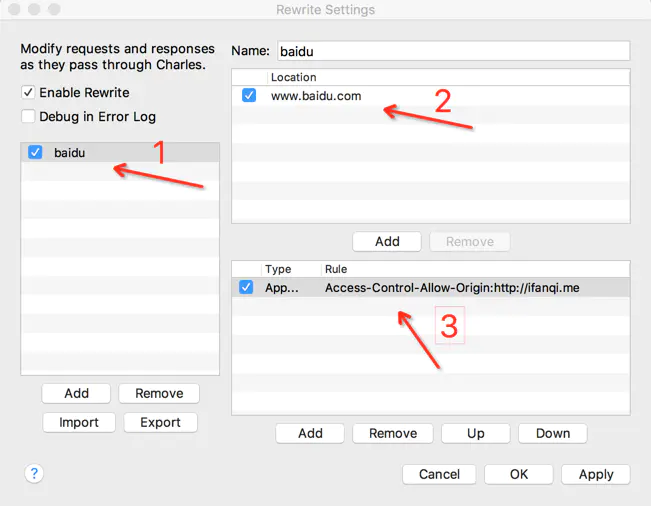
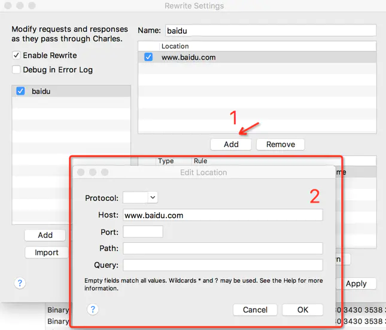
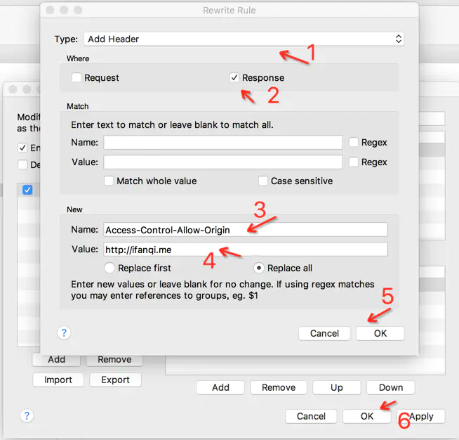

title:数据请求
---

> 该文档主要提供如何使用CML内置提供的数据mock能力，web端跨域能力

## web端跨域能力

`chameleon-tool@1.0.6-alpha.6 ` 版本开始支持

在项目中执行 `cml web dev ` 启动项目
然后在新开一个终端 执行 `npm run server` 在本地启动一个服务用来测试跨域

## 如何使用数据 mock

首先参考文档[如何使用数据mock](http://cml.didi.cn/docs/build.html#%E9%85%8D%E7%BD%AE-mock-%E6%95%B0%E6%8D%AE)

`mock/api/index.js`中
```javascript

module.exports = [
  {
    method: ['get', 'post'],
    path: '/api/getMessage',
    controller: function (req, res, next) {
      res.json({
        total: 0,
        message: [{
          name: 'Hello chameleon!'
        }]
      });
    }
  }
]
```
`src/pages/index/index.cml`中

```javascript
import cml from 'chameleon-api'
handleMock(){
  cml.get({
    url:'/api/getMessage'
  }).then((res) => {
    console.log(res);
  })
}


```

## 如何使用在开发阶段使用跨域

* 一般情况下，我们直接使用数据mock可以解决大部分问题。

* 如果遇到浏览器的跨域问题，也可以通过设置代理的方式进行解决，比如网上随便搜下`charles 代理设置跨域`，都能找到解决方案。

[charles如何设置代理跨域](https://juejin.im/post/5a1033d2f265da431f4aa81f)


修改https的请求响应头前面讲了一个场景，如何在开发阶段实现跨域，也说到了利用charles修改https响应头即可实现，具体操作步骤如下：
这里举个例子，我想让我的ifanqi.me域名下的页面去访问百度下面的一个接口，步骤如下：


1.菜单-> Tools -> Rewrite,打开设置面板。
2.添加一条规则



3.添加响应头



ifanqi.me下的页面就可以访问百度的接口啦。有兴趣的同学可以试下，通过修改请求头和响应头，我们可以随意调用别的网站的接口，与此同时加深自己对http(s)协议的理解。

* 为了方便开发者,我们内置支持了配置选项，支持直接配置【web端跨域】


